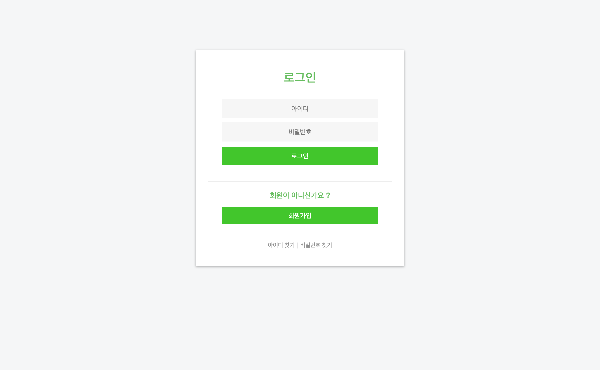
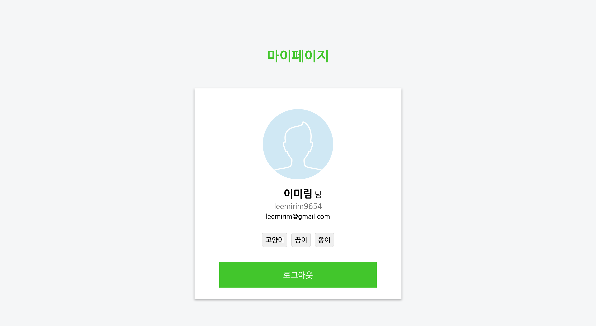

<h1 align="center"> 로그인과 회원가입 프로젝트 🍀</h1>

> 네이버 로그인 & 회원가입 클론 프로젝트

## 프로젝트 개발자

👤 **이미림(always-awake)**

* Github: [@always-awake](https://github.com/always-awake)

## 배포 URL
* 해로쿠를 이용한 배포
* [무료 도메인 사용](https://my.freenom.com)
* 주소: http: http://boostcamp-login.ga/
* 헤로쿠 주소: https://boostmember-login.herokuapp.com/

## 폴더 및 주요 소스 파일 구조
```
1_login_signup
└── app
    └── bin
    └── db
        └── settins
            └── sessions.js
            └── users.js
    └── public
        └── css
        └── images
        └── js
    └── routes
    └── views (pug 템플릿 엔진 사용)
    └── app.js
```
* SPA로 구현

## 이슈 관리
- [네이버 로그인 & 회원가입 클론 프로젝트 issues page](https://github.com/always-awake/membership-login/issues)


## 서비스 화면 
* 로그인 페이지 <br>


* 회원가입 페이지 <br>


* 마이 페이지 <br>



